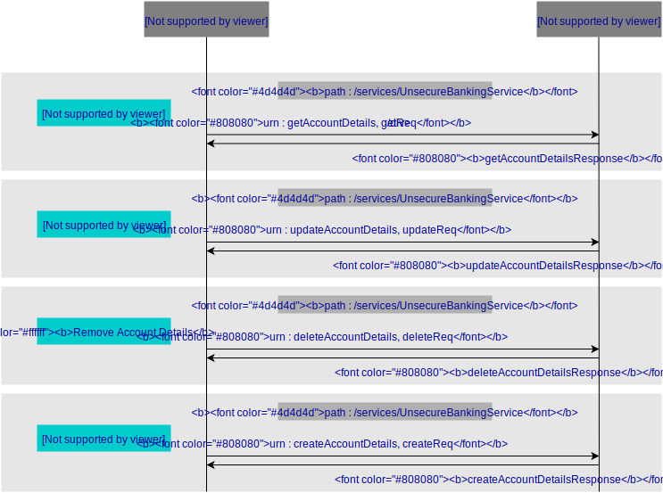

# SOAP Service
Web services are of two kinds: Simple Object Access Protocol (SOAP) and Representational State Transfer (REST). 
SOAP defines a standard communication protocol (set of rules) specification for XML-based message exchange. 
Its purpose is to induce extensibility, neutrality and independence. It uses XML Information Set for its message format, and relies on application layer protocols, most often Hypertext Transfer Protocol (HTTP) or Simple Mail Transfer Protocol (SMTP), for message negotiation and transmission.

> In this guide you will learn about deploying a custom SOAP Web service in the back-end and consuming that service using Ballerina SOAP Connectors.

The following are the sections available in this guide.

- [What you'll build](#what-youll-build)
- [Prerequisites](#prerequisites)
- [Implementation](#implementation)
- [Testing](#testing)
- [Deployment](#deployment)
- [Observability](#observability)

## What you’ll build 
To understand how to use Ballerina language's features to write a SOAP connector which communicates with a unsecure SOAP web service running in the back-end, Let's consider a real world use case of a banking service running online where users can view, update, delete and create accounts. You can model this banking service as a SOAP Web service which is not secure; 'unsecure_banking_service', which is deployed as an Axis2 services in the back-end and accepts different SOAP requests for banking tasks such as account creation, retrieval, updating and deletion.In order to communicate with this SOAP service we are going to exploit the power of the Ballerina SOAP connector.The following diagram illustrates all the required functionality of the Ballerina SOAP connector you are going to build and the Unsecure Banking Service you are going to deploy.



- **Retrieve Account Details** : To fetch the account details, sends a SOAP request with the account number calling the getAccountDetails SOAP action.
- **Update Account Details** : To update the account balance, sends a SOAP request with account number and the updated account balance calling the updateAccountDetails SOAP action.
- **Remove Account Details** : To delete an account, sends a SOAP request with account number to be deleted calling the deleteAccountDetails SOAP action.
- **Create Account Details** : To create a new account, sends a SOAP request with account number, account holder name and account balance to be created calling the createAccountDetails SOAP action.

## Prerequisites
 
- [Ballerina Distribution](https://ballerina.io/learn/getting-started/)
- A Text Editor or an IDE 

### Optional requirements
- Ballerina IDE plugins ([IntelliJ IDEA](https://plugins.jetbrains.com/plugin/9520-ballerina), [VSCode](https://marketplace.visualstudio.com/items?itemName=WSO2.Ballerina), [Atom](https://atom.io/packages/language-ballerina))
- [Docker](https://docs.docker.com/engine/installation/)
- [Kubernetes](https://kubernetes.io/docs/setup/)

## Implementation

> If you want to skip the basics, you can download the git repo and directly move to the "Testing" section by skipping  "Implementation" section.

Let's use the following package structure for this project.

```
consuming-a-soap-service
 └── guide
      └── consuming_a_soap_service
           ├── banking_connector.bal
           ├── secure_banking_connector.bal
           ├── unsecure_banking_connector.bal
  	   └── tests
	        └── consuming_a_soap_service_test.bal
```

- Create the above directories in your local machine, along with the empty `.bal` files.

- Then open the terminal, navigate to consuming-a-soap-service/guide, and run the Ballerina project initializing toolkit.
```bash
   $ ballerina init
```

### Deploying the back-end SOAP web service
- [Setup the WSO2 Axis2 Server with the new UnsecureBankingService sample](https://docs.wso2.com/display/EI620/Setting+Up+the+ESB+Samples#SettingUptheESBSamples-Deployingsampleback-endservices).
- Download the **UnsecureBankingService** source code and extract it to **<EI_HOME>/samples/axis2Server/src/** folder
- Navigate to **UnsecureBankingService** folder and execute the ant build - **ant**
- [Run the axis2 server](https://docs.wso2.com/display/EI620/Setting+Up+the+ESB+Samples#SettingUptheESBSamples-StartingtheAxis2server)

